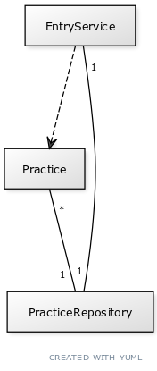
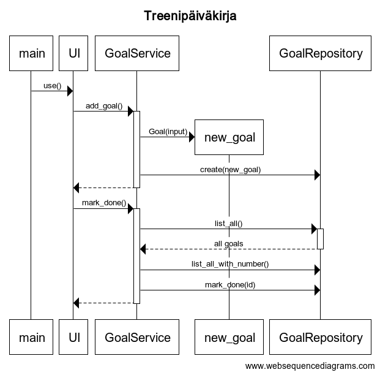

# Arkkitehtuurikuvaus

## Rakenne

Ohjelman osien välisiä suhteita kuvaava luokkakaavio

Ohjelman toimintalogiikkaa kuvaava sekvenssikaavio: uuden tavoitteen lisääminen ja tavoitteen merkitseminen saavutetuksi

