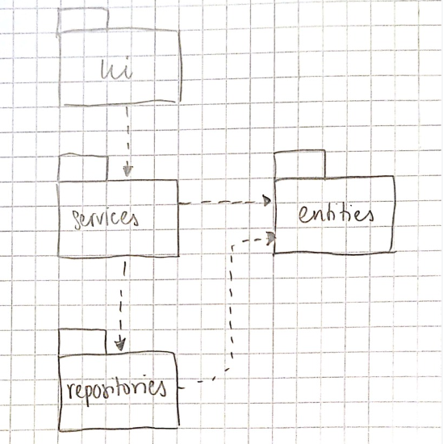
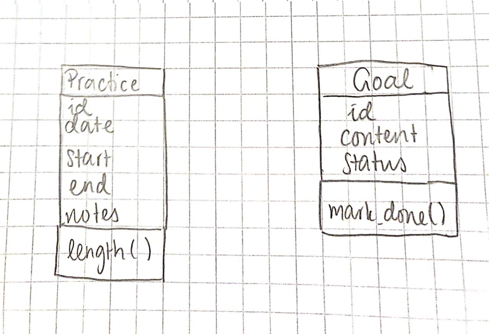
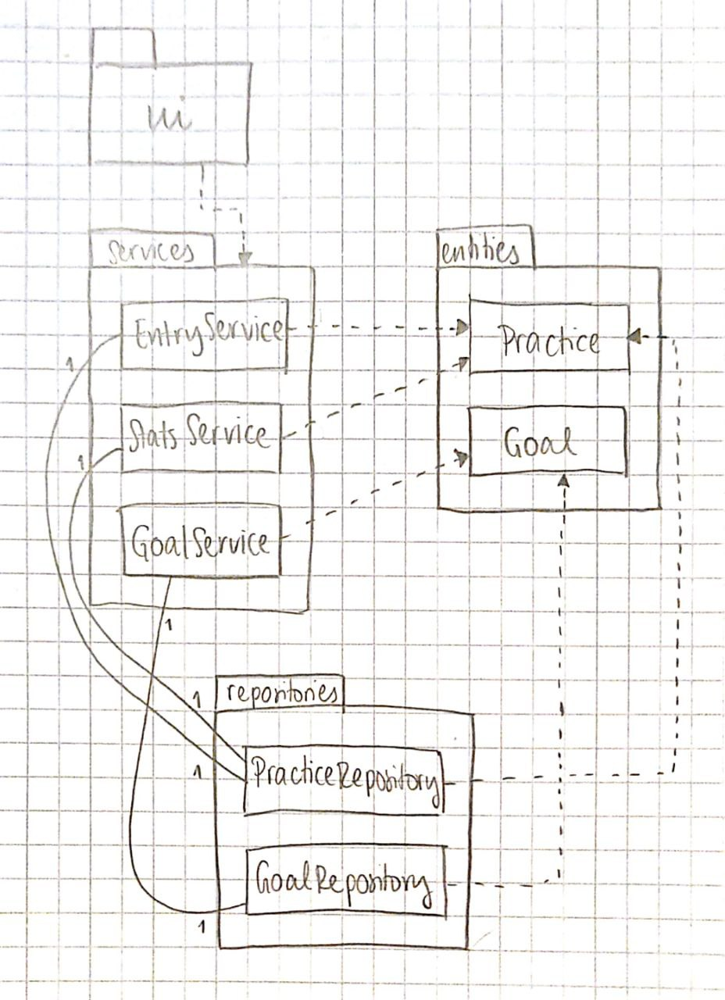
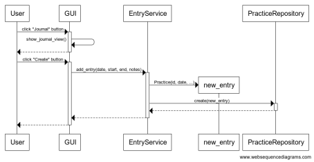
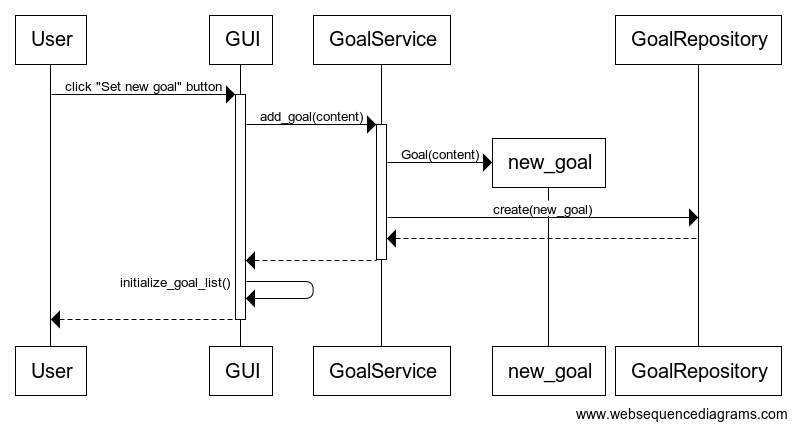
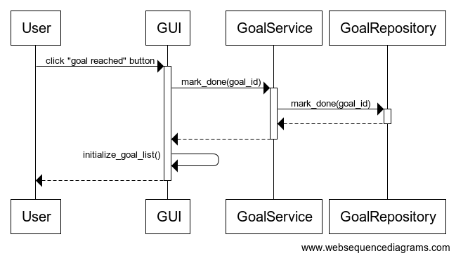

# Arkkitehtuurikuvaus

## Rakenne

Sovelluksen rakenteessa on noudatettu kolmitasoista kerrosarkkitehtuuria. Pakkausrakenne on kuvattu oheisessa kaaviossa:



Pakkaukset sisältävät ohjelman koodin seuraavasti jaoteltuna:
- Pakkaus *ui* sisältää käyttöliittymästä vastaavan koodin
- Pakkaus *services* sisältää sovelluslogiikasta vastaavan koodin
- Pakkaus *repositories* sisältää datan tallennuksesta vastaavan koodin
- Pakkaus *entities* sisältää luokat joilla kuvataan sovelluksen käyttämää dataa

## Käyttöliittymä

Sovelluksen käyttöliittymässä on viisi erillista näkymää, joista jokainen on toteutettu erillisenä luokkana:
- Päävalikko
- Uuden treenimerkinnän luominen
- Treenimerkintöjen lista
- Tavoitelista
- Tilastonäkymä

Näkymien näyttämisesta ja vaihtamisesta vastaa [GUI](https://github.com/Ronttikasa/treenipaivakirja/blob/master/src/ui/gui.py)-luokka. Näkymistä näytetään aina yksi kerrallaan.

Käyttöliittymä ja sovelluslogiikka on pyritty eriyttämään toisistaan mahdollisimman hyvin. Käyttöliittymästä kutsutaan [*services*-pakkauksen](https://github.com/Ronttikasa/treenipaivakirja/tree/master/src/services) luokkien metodeja.

Tavoitteet listaavassa näkymässä kutsutaan metodia [initialize_goal_list](https://github.com/Ronttikasa/treenipaivakirja/blob/3ee7f624aa916d4e072aed377ffd3c21275fce92/src/ui/goals_view.py#L68) aina kun luodaan uusia tavoitteita tai merkitään vanhoja tavoitteita saavutetuksi. Metodi saa sovelluslogiikalta listan näytettävistä tavoitteista ja muodostaa tavoitenäkymän uudelleen. Treenipäiväkirjanäkymän [initialize_entry_list](https://github.com/Ronttikasa/treenipaivakirja/blob/3ee7f624aa916d4e072aed377ffd3c21275fce92/src/ui/journal_list_view.py#L63)-metodi toimii vastaavasti kun luodaan uusia treenimerkintöjä tai poistetaan vanhoja.

## Sovelluslogiikka

Sovelluksen luokat [Goal](https://github.com/Ronttikasa/treenipaivakirja/blob/3ee7f624aa916d4e072aed377ffd3c21275fce92/src/entities/goal.py#L4) ja [Practice](https://github.com/Ronttikasa/treenipaivakirja/blob/3ee7f624aa916d4e072aed377ffd3c21275fce92/src/entities/practice.py#L4) kuvaavat sovelluksen tallentamia tietoja: tavoitteita ja treenimerkintöjä.



Sovelluslogiikasta vastaavat luokkien [EntryService](https://github.com/Ronttikasa/treenipaivakirja/blob/master/src/services/entry_service.py), [GoalService](https://github.com/Ronttikasa/treenipaivakirja/blob/master/src/services/goal_service.py) ja [StatsService](https://github.com/Ronttikasa/treenipaivakirja/blob/master/src/services/stats_service.py) oliot. Nimiensä mukaisesti nämä vastaavat treenimerkintöihin, tavoitteisiin sekä tilastointiin liittyvistä palveluista. Luokat tarjoavat käyttöliittymän toiminnoille omat metodit, esimerkiksi:

- `add_entry(entry_date, start, end, notes)`
- `delete_entry(entry_id)`
- `add_goal(content)`
- `mark_done(goal_id)`
- `average_duration()`

Luokat `GoalService`, `EntryService` ja `StatsService` käsittelevät treenimerkintöjä ja tavoitteita tietojen tallennuksesta ja lukemisesta huolehtivien luokkien [PracticeRepository](https://github.com/Ronttikasa/treenipaivakirja/blob/master/src/repositories/practice_repository.py) ja [GoalRepository](https://github.com/Ronttikasa/treenipaivakirja/blob/master/src/repositories/goal_repository.py) kautta. Näiden luokkien oliot injektoidaan sovelluslogiikan luokille konstruktorikutsun yhteydessä.

Ohjelman osien suhdetta kuvaa seuraava luokka/pakkauskaavio:



## Tiedon pysyväistallennus

Pysyväistallennuksesta vastaavat *repositories*-pakkauksen luokat `PracticeRepository` ja `GoalRepository`. Molemmat tallettavat tietoa tekstitiedostoon.

Sovellus on suunniteltu siten, että tallennuksesta vastaavat luokat on mahdollista myöhemmin korvata uusilla toteutuksilla, jos tallennustavaksi halutaan vaihtaa esimerkiksi tietokantaan tallentaminen. Esimerkiksi sovelluslogiikan testauksessa tämä on huomioitu siten, että siinä käytetään keskusmuistiin tallentavia olioita tiedostoon tallentamisen sijasta.

### Tiedostot

Sovellus tallentaa tavoitteet ja treenipäiväkirjamerkinnät omiin txt-tiedostoihinsa. Näiden tiedostojen nimet on määritelty juurihakemiston [konfiguraatiotiedostossa *.env*](https://github.com/Ronttikasa/treenipaivakirja/blob/master/.env).

Treenimerkinnät tallennetaan tiedostoon muodossa merkinnän id, päivämäärä, alkuaika, loppuaika, muistiinpanot. Kentät erotetaan puolipisteellä (;). Esimerkiksi:

```
7a3204ff-ed0c-49f6-9387-d783b9cbd12a;12/21/21;13:40;14:50;rittiä ja piruetteja
8d49e062-5c09-484a-b3fc-dffaf54f1fee;12/23/21;13:30;15:00;piruetteja ja hyppyjä
```

Tavoitteet tallennetaan tiedostoon muodossa tavoitteen id, tavoitteen kuvaus, status (saavutettu = True, saavuttamatta = False), kentät erotetaan puolipisteellä (;). Esimerkiksi:

```
703e9205-0c35-4390-b4d9-e1f5a94bed95;loop by end of 2021;True
c195b751-2ab5-4ef8-a550-389be8ee644b;flip by end of 2021;False
2edca10c-b9cd-4f14-ad3a-7b2964139de6;loop with nice landing;False
5c782286-bf88-4cee-bea6-e096d2a85dde;scratch spin;False
```

## Päätoiminnallisuudet

Seuraavissa sekvenssikaavioissa kuvataan joitakin sovelluksen päätoiminnallisuuksia.

### Uuden treenimerkinnän lisääminen

Kun käyttäjä siirtyy päävalikosta treenimerkinnän luomisnäkymään ja luo uuden merkinnän, sovelluksen kontrolli etenee seuraavalla tavalla:



"Journal"-painiketta klikattaessa [tapahtumankäsittelijä](https://github.com/Ronttikasa/treenipaivakirja/blob/6550aed7d374dc3c08f12a4afc5f7f1f48b70850/src/ui/main_view.py#L31) kutsuu käyttöliittymän [show_journal_view](https://github.com/Ronttikasa/treenipaivakirja/blob/6550aed7d374dc3c08f12a4afc5f7f1f48b70850/src/ui/gui.py#L36)-metodia ja käyttöliittymä vaihtaa näkymäksi `JournalView`-näkymän.

Nyt käyttäjä antaa syötekenttiin uuden merkinnän luomiseksi tarvittavat tiedot ja painaa "Create"-painiketta. [Tapahtumankäsittelijä](https://github.com/Ronttikasa/treenipaivakirja/blob/6550aed7d374dc3c08f12a4afc5f7f1f48b70850/src/ui/journal_view.py#L138) kutsuu `EntryService`:n metodia [add_entry](https://github.com/Ronttikasa/treenipaivakirja/blob/6550aed7d374dc3c08f12a4afc5f7f1f48b70850/src/services/entry_service.py#L24) parametreina syötekentistä saadut aikatiedot sekä muistiinpanot. Sovelluslogiikka luo näistä tiedoista uuden `Practice`-olion ja tallentaa sen kutsumalla `PracticeRepository`n metodia `create`. Käyttöliittymä tyhjentää syötekentät kun uusi merkintä on luotu onnistuneesti.

### Uuden tavoitteen luominen

Goals-näkymässä "Set new goal" -painikkeen klikkaamisen jälkeen sovelluksen kontrolli etenee seuraavalla tavalla:



[Tapahtumankäsittelijä](https://github.com/Ronttikasa/treenipaivakirja/blob/6550aed7d374dc3c08f12a4afc5f7f1f48b70850/src/ui/goals_view.py#L117) kutsuu sovelluslogiikan `GoalService`-luokan metodia [add_goal](https://github.com/Ronttikasa/treenipaivakirja/blob/6550aed7d374dc3c08f12a4afc5f7f1f48b70850/src/services/goal_service.py#L14) parametrinaan käyttäjän antama syöte. Sovelluslogiikka luo uuden `Goal`-olion ja kutsuu `GoalRepository`n metodia `create`, joka tallentaa tavoitteen tiedot tiedostoon. Käyttöliittymä kutsuu tavoitteen luomisen jälkeen omaa metodiaan `initialize_goal_list` ja päivittää näin näytettävän tavoitenäkymän.

### Tavoitteen merkkaaminen saavutetuksi ja muut toiminnallisuudet

Kun käyttäjä klikkaa tavoitenäkymässä tavoitteen kohdalla "Reached!"-painiketta, sovelluksen kontrolli etenee seuraavan kaavion kuvaamalla tavalla:



Tässä ja muissa sovelluksen toiminnallisuuksissa toiminta etenee samantyyppisesti aiemmin kuvattujen toiminnallisuuksien kanssa. Käyttöliittymästä siis kutsutaan sovelluslogiikkakerroksen metodeja jotka puolestaan kutsuvat tallennustiedostoja käsitteleviä repositoriokerroksen metodeja. Käyttöliittymä päivittää tarvittaessa näytettävien tietojen listaa toiminnon suorittamisen jälkeen.


