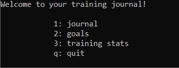
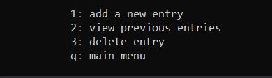
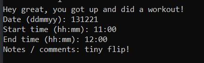
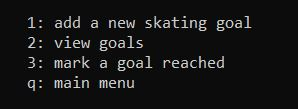
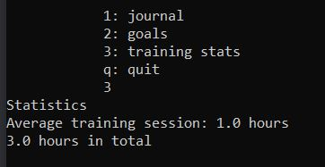

# Käyttöohje

Lataa projektin tuoreimman [releasen](https://github.com/Ronttikasa/treenipaivakirja/releases) lähdekoodi.

## Käyttö

Sovellus käynnistyy päävalikkonäkymään:

Komennolla 1 siirrytään treenipäiväkirjaan, komennolla 2 tavoitelistaukseen, komennolla 3 harjoitustilastoihin. Komento q lopettaa ohjelman.

## Treenipäiväkirja

Näkymässä voidaan luoda uusi merkintä treenipäiväkirjaan komennolla 1 ja seuraten tämän jälkeen ohjelman antamia ohjeita, tarkastella vanhoja merkintöjä komennolla 2 sekä poistaa merkintöjä komennolla 3.

Komennolla q palataan päävalikkoon.

## Tavoitteet

Näkymässä voidaan luoda uusia tavoitteita komennolla 1, tarkastella kaikkia tavoitteita komennolla 2 ja merkitä tavoite saavutetuksi komennolla 3.
Komennolla q palataan päävalikkoon.

## Harjoitustilastot

Toiminto tarjoaa tilastoja treenipäiväkirjan merkinnöistä. Tilastojen tulostamisen jälkeen ohjelma palaa päävalikkoon.

