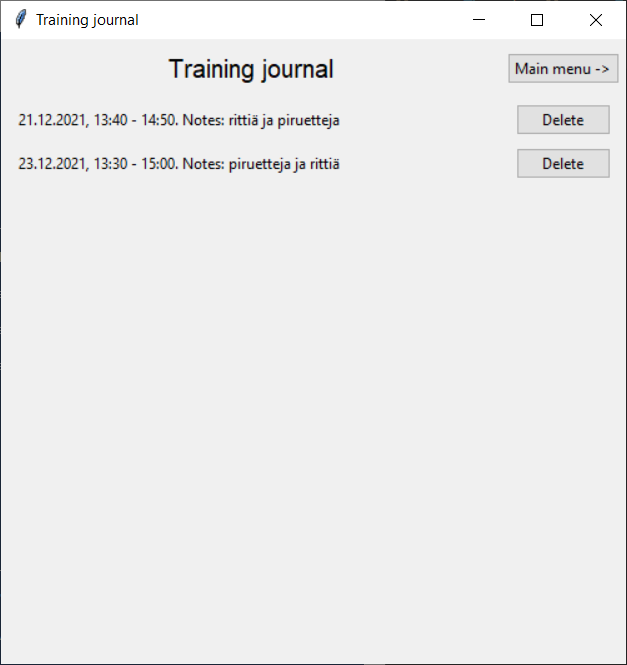

# Käyttöohje

Lataa projektin tuoreimman [releasen](https://github.com/Ronttikasa/treenipaivakirja/releases) lähdekoodi.

## Konfigurointi

Tietojen tallentamiseen käytettävien tiedostojen nimiä voi halutessaan muokata juurihakemiston *.env*-tiedostossa. Tiedostot sijaitsevat *data*-hakemistossa ja ne luodaan sinne automaattisesti. Tiedoston muoto on seuraava:

```
GOALS_FILENAME=training_goals.txt
JOURNAL_FILENAME=trainingjournal.txt
```

## Ohjelman käynnistäminen

Ennen ensimmäistä käyttökertaa asenna sovelluksen riippuvuudet komennolla:

```bash
poetry install
```

Tämän jälkeen sovellus käynnistetään komennolla:

```bash
poetry run invoke start
```

## Ohjelman käyttö

### Päävalikko

Sovellus avautuu päävalikkonäkymään.


Sovelluksessa on kolme eri toimintoa: Varsinainen treenipäiväkirja (journal), tavoitelistaus (goals) sekä treenien tilastointi (stats).

### Treenipäiväkirja

Päävalikon "Journal"-painikkeesta siirrytään uuden treenimerkinnän lisäämisnäkymään.


Uuden merkinnän luominen onnistuu valitsemalla kalenterista päivämäärä, kirjoittamalla treenin alkamis- ja loppumisajat sekä treeniin liittyvät kommentit syötekenttiin ja painamalla "Create"-painiketta. Notes-kentän voi myös jättää tyhjäksi.

Tehtyjä merkintöjä voi tarkastella yläreunan "View previous entries" -painikkeesta.



Yläreunan "Main menu" -painiketta klikkaamalla siirrytään takaisin päävalikkoon.

## Tavoitteet

Päävalikon "Goals"-painikkeesta avautuu näkymä jossa voi sekä luoda uusia tavoitteita, tarkastella olemassaolevia tavoitteita sekä merkata niitä saavutetuiksi.


Tavoite voidaan asettaa saavutettu-tilaan painamalla tavoitteen vieressä olevaa "Reached!"-painiketta. Tavoite asetetaan saavutetuksi ja se poistetaan näytettävältä listalta.

Uusi tavoite luodaan kirjoittamalla syötekenttään tavoitteen kuvaus ja painamalla "Set new goal" -painiketta.

Yläreunan "Main menu" -painikkeesta sovellus palaa päävalikkonäkymään.

## Harjoitustilastot

Päävalikon "Stats"-painikkeesta siirrytään tilastonäkymään. Toiminto tarjoaa käyttäjälle tilastoja treenipäiväkirjaan tehdyistä merkinnöistä.


Yläreunan "Main menu" -painikkeesta sovellus palaa takaisin päävalikkoon.


