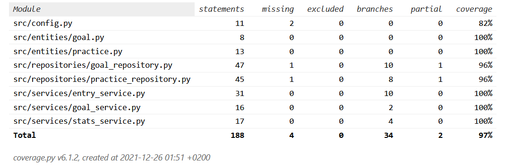

# Testausdokumentti

# LINKIT + JÄRJESTELMÄTESTAUS PUUTTUU

Ohjelmaa on testattu unittestilla automatisoiduin testein sekä manuaalisilla järjestelmätason testeillä.

## Yksikkö- ja integraatiotestaus

### Sovelluslogiikka

Sovelluslogiikasta vastaavat luokat `EntryService` treenipäiväkirjatoiminnallisuuden, `GoalService` tavoitteiden ja `StatsService` tilastotoiminnallisuuden osalta.

Luokkaa `EntryService` testataan [TestEntryService]()-testiluokalla. `EntryService`-olio on testauksessa alustettu niin, että sille on injektoitu valekomponenttina repositorio-oliot jotka tallentavat tietoa muistiin tekstitiedoston sijasta. Tähän tarkoitukseen testeissä on käytetty luokkaa `FakePracticeRepository`.

Luokkaa `GoalService` testataan [TestGoalService]()-luokalla. Kuten edellä, `GoalService`-oliolle on injektoitu riippuvuutena valekomponentti; muistiin tallentava `FakeGoalRepository`-olio.

Luokkaa `StatsService` testataan [TestStatsService]()-testiluokalla. Myös tämän luokan testauksessa käytetään valekomponenttina luokan `FakePracticeRepository` oliota.

### Repositorio-luokat

Repositorio-luokkien `PracticeRepository` ja `GoalRepository` testauksessa käytetään pelkästään testeissä käytössä olevia tiedostoja, joiden nimet voidaan konfiguroida *.env.test*-tiedostossa. `PracticeRepository`-luokkaa testataan testiluokalla [TestPracticeRepository]() ja `GoalRepository`-luokkaa testiluokalla [TestGoalRepository]().

### Goal- ja Practice-luokat

Sovellus käsittelee tiedostoon talletettavaa tietoa `Goal`- ja `Practice`-luokkien olioina. Näitä luokkia testataan [TestGoal]()- ja [TestPractice]()-testiluokilla.

### Testauskattavuus

Sovelluksen testauksen haarautumakattavuus on 97%. Käyttöliittymän koodi ei ole mukana testauksessa.

## Järjestelmätestaus

Sovellusta on testattu manuaalisesti järjestelmätasolla.

### Asennus ja konfigurointi

Sovellus on asennettu ja testattu käyttöohjeessa kuvatulla tavalla Windows- ja Linux-ympäristöissä. 

### Toiminnallisuudet

Järjestelmätestauksessa on käyty läpi määrittelydokumentissa ja käyttöohjeessa mainitut toiminnallisuudet. Testauksen yhteydessä on yritetty antaa myös virheellisiä syötteitä, kuten väärässä muodossa olevia kellonaikoja ja tyhjiä syötteitä.

## Sovellukseen jääneet laatuongelmat

Sovellus ei anna järkevää virheilmoitusta mikäli konfiguraatiotiedostossa määriteltyihin tiedostoihin ei ole luku- tai kirjoitusoikeuksia.